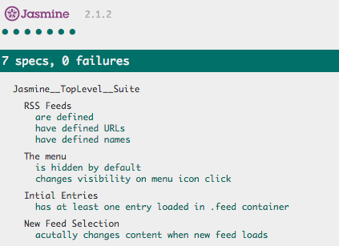

# Project Overview

This project is the final assignment in the Udacity Front-end Developer Nanodegree course.  In this project I was given a web-based application that reads RSS feeds. The original developers of this application already included [Jasmine](http://jasmine.github.io/) and even started writing the first test suite! Unfortunately, they decided to move on to start their own company and I need to complete the project tests.

Click <a href="https://heyjane.github.io/frontend-nanodegree-feedreader">here</a> to view this project online.  You will see the RSS feeds displayed on the top half of your screen, and the Jasmine results showing 7 tests with 0 failures (see screenshot below).

You can view the Jasmine spec file source code at
<a href="https://github.com/heyjane/frontend-nanodegree-feedreader/blob/master/jasmine/spec/feedreader.js">https://github.com/heyjane/frontend-nanodegree-feedreader/blob/master/jasmine/spec/feedreader.js</a>.  The file <a href="https://github.com/heyjane/frontend-nanodegree-feedreader/blob/master/resources.txt">https://github.com/heyjane/frontend-nanodegree-feedreader/blob/master/resources.txt</a> describes the resources
used to research and complete this project.

## Why this project?

The purpose of this project is to practice test-driven code development using Jasmine and analyzing existing HTML, CSS, and JavaScript code applications.

# What tests did I include?

Preliminary test: I edited the allFeeds variable in <a href="https://github.com/heyjane/frontend-nanodegree-feedreader/blob/master/js/app.js">js/app.js</a> to make the provided test fail and see how Jasmine visualizes this failure in the application.  After verifying this, I returned
the allFeeds variable to a passing state.

Test 1: Ensure each feed in the allFeeds object has a defined URL that is not empty.

Test 2: Loop through each feed in the allFeeds object and ensure it has a name defined and that the name is not empty.

Test 3: Add a new test suite named "The menu" and ensure the menu element is hidden by default.

Tests 4 and 5: Ensure the menu changes visibility when the menu icon is clicked. This test should have two expectations: menu should display when clicked and hide when clicked again.

Test 6: When the loadFeed function is called and completes its work, there should be at least a single .entry element within the .feed container. Note that loadFeed() is asynchronous so this test requires use of Jasmine's beforeEach and asynchronous done() function.

Test 7: When a new feed is loaded by the loadFeed function, the content should actually change.

Expectation: All <a href="https://github.com/heyjane/frontend-nanodegree-feedreader/tree/master/jasmine/spec">Jasmine tests</a> pass.  Here is a
screenshot of the successful test execution:

